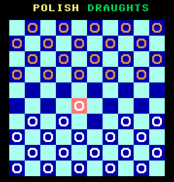
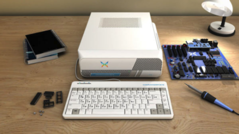

# P8Checkers
Written in Prog8 language Polish Checkers game for 8-bit Commander X16 machine.

Polish Checkers aka International draughts is a very similar game to American checkers. The main differences from English draughts are: the size of the board (10×10), pieces can also capture backward (not only forward), the long-range moving and capturing capability of kings known as flying, and the requirement that the maximum number of men be captured whenever a player has capturing options.

More info: https://en.wikipedia.org/wiki/International_draughts

## Requirements

1. GPP (Generic Preprocessor) - For merging source code and targeting code both for X16 and C64.
2. Prog8 compiler - https://prog8.readthedocs.io/en/latest/
3. 64tass assembler - required by Prog8
4. Commander X16 or Commodore 64 emulator - to run a compiled program

## P8Checkers running in emulator

## Commander X16 itself
This is how the computer may look like:

